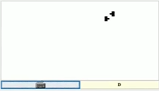

# Two tanks game
Two tanks game is a game written in jack. The game was written as part of the course Nand to Tetris. https://www.nand2tetris.org

Two tanks game is a simple game for two players.
Every player controls one tank.
the tanks are moving on a grid 32 on 16.

Here is a link to a video in with a demonstration of the game:
https://www.youtube.com/watch?v=XhiALA1evZM

## Instractions of the game
The instractions are writen in the game, and here is an image with them:

## Playing the game
To play the game do the next steps:

* Download the VM files from the directory vm.
* Put the vm files in a single directory.
* Download the VMEmulator from https://www.nand2tetris.org.
* Run the VMEmulator.
* Select in the menu File and in File Load Program and point to the directory containing the .vm files
* Select in the menu View and in View Animate and in Animate No Animation and set the slider to 'Fast'
* When you ready ti paly press the F5 button to run the game.
